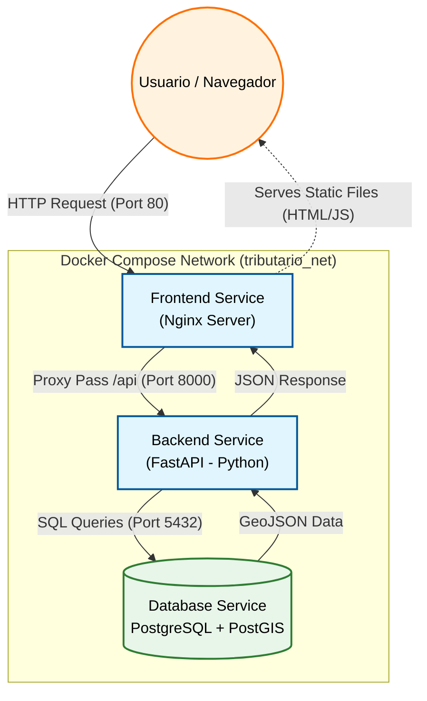

# Arquitectura de Red y Comunicación de Servicios

Este diagrama representa la comunicación entre los contenedores Docker del sistema.

```mermaid
graph TD
    %% Definición de Estilos
    classDef container fill:#e1f5fe,stroke:#01579b,stroke-width:2px,color:#000;
    classDef external fill:#fff3e0,stroke:#ff6f00,stroke-width:2px,color:#000;
    classDef database fill:#e8f5e9,stroke:#2e7d32,stroke-width:2px,color:#000;

    %% Nodos Externos
    User(("Usuario / Navegador")):::external

    %% Docker Network
    subgraph DockerNet ["Docker Compose Network (tributario_net)"]
        direction TB
        
        %% Frontend Service
        Frontend["Frontend Service<br/>(Nginx Server)"]:::container
        
        %% Backend Service
        Backend["Backend Service<br/>(FastAPI - Python)"]:::container
        
        %% Database Service
        DB[("Database Service<br/>PostgreSQL + PostGIS")]:::database
    end

    %% Conexiones
    User -- "HTTP Request (Port 80)" --> Frontend
    Frontend -.-> |"Serves Static Files (HTML/JS)"| User
    Frontend -- "Proxy Pass /api (Port 8000)" --> Backend
    Backend -- "SQL Queries (Port 5432)" --> DB
    DB -- "GeoJSON Data" --> Backend
    Backend -- "JSON Response" --> Frontend

    %% Notas (Clickable events)
    click Frontend "http://localhost" "Abrir Frontend"
```
